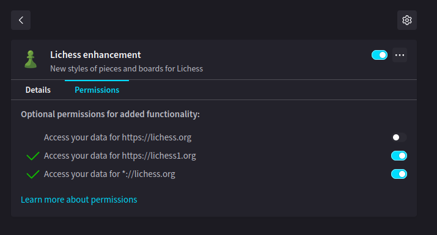

<h1 align="center">


</h1>

```diff
! The extension can reduce fps in bullet/ultrabullet
```

## Chrome

[CRX download link](https://www.mediafire.com/file/bhk7lgf5sde7f9r/lichess_enhancement.crx/file)

## Firefox

Note: you must be on Firefox Developer, Nightly, or ESR for this to work.

First, go to `about:config` and set `xpinstall.signatures.required` to `false`, and then load [this](https://www.mediafire.com/file/l64yyc3my4pd0dv/lichess_enhancement-4.1.zip/file) XPI.

Make sure to select both optional permissions in `about:addons` for the extension to work properly:


